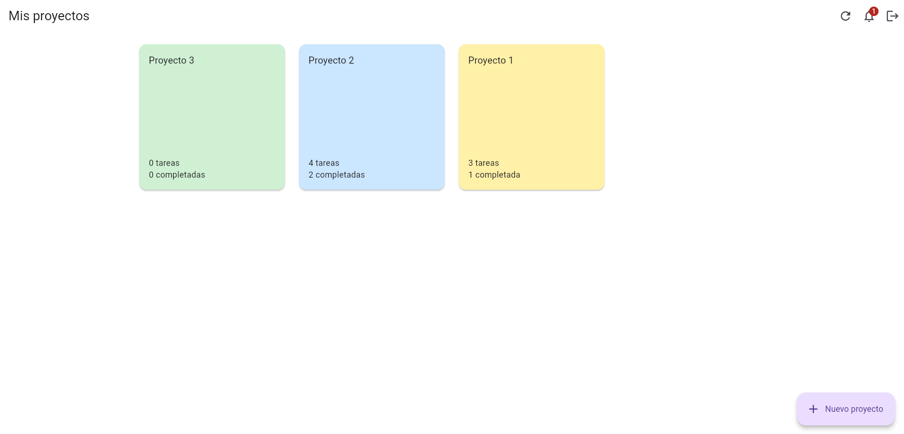
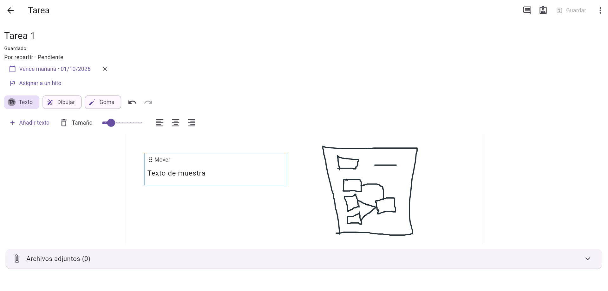
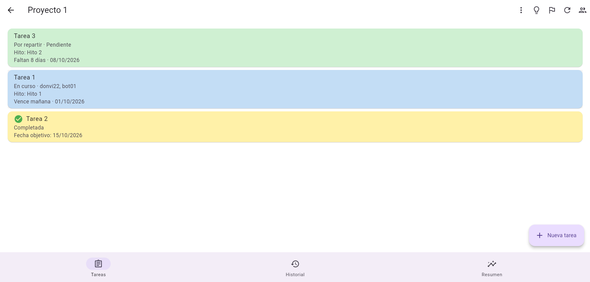
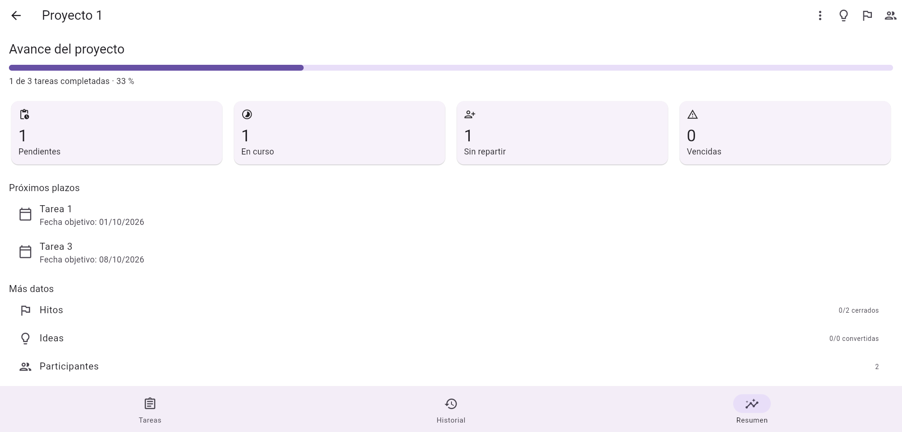
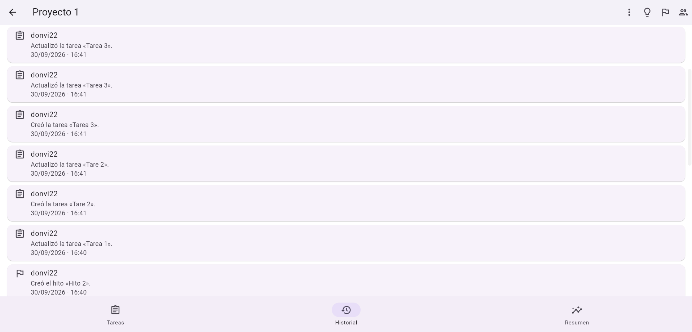

# Pizapp

Una aplicación para organizar proyectos en equipo y desarrollar cada tarea en una pizarra: texto, dibujos, responsables, fechas y comentarios en el mismo espacio de trabajo.

**[Abrir la demo](https://donvi22.pythonanywhere.com/)** · [Arquitectura y permisos](docs/arquitectura.md) · [Despliegue](deploy/LEEME_despliegue.md)

Proyecto de portfolio orientado al desarrollo backend con Python. El servidor usa Django y Django REST Framework; el cliente está desarrollado con Flutter.

## Probar la demo

1. Crea una cuenta desde la pantalla de acceso.
2. Crea un proyecto y una tarea.
3. Abre la tarea, añade texto y dibuja en la pizarra. Guarda los cambios.
4. Crea una plaza para un colaborador y comparte el enlace de invitación. Con una segunda cuenta puedes comprobar los permisos y el reparto de trabajo.
5. Consulta el resumen, los comentarios, el historial y las notificaciones.

La demo utiliza una base de datos independiente de la instalación local. Los límites de archivos son 20 MiB por archivo, 100 MiB por proyecto y 200 MiB en total para la demo.

## Funcionalidades

- Proyectos y tareas con colores, estados y fechas de vencimiento.
- Pizarra con bloques de texto móviles, tamaño y alineación del texto, dibujo, colores, grosor, goma y deshacer/rehacer compartidos entre texto y dibujo.
- Guardado explícito y aviso antes de abandonar cambios pendientes.
- Invitaciones, miembros del proyecto y permisos de edición por tarea.
- Reparto entre responsables, seguimiento individual y actualización del estado global de la tarea.
- Hitos, ideas convertibles en tareas y comentarios.
- Archivos adjuntos con descarga autenticada y límites de almacenamiento.
- Resumen de proyecto, historial de actividad y notificaciones dentro de la aplicación.
- Sesión persistente e interfaz adaptable a pantallas pequeñas.

<!-- CAPTURAS_INICIO -->

## Capturas











<!-- CAPTURAS_FIN -->

## Tecnologías

| Capa | Tecnología |
| --- | --- |
| API y reglas de negocio | Python, Django 6.1.1, Django REST Framework 3.18.1 |
| Cliente | Flutter 3.47.5, Dart 3.13.4 |
| Base de datos | SQLite |
| Autenticación | Token de Django REST Framework; almacenamiento del token con flutter_secure_storage |
| Demo | Flutter Web y Django en PythonAnywhere, mediante HTTPS |
| Comprobaciones automáticas | GitHub Actions: tests de Django, análisis y compilación web de Flutter |

## Decisiones del backend

Los permisos se comprueban en la API además de reflejarse en la interfaz. Un usuario ajeno al proyecto no puede acceder a sus tareas ni descargar sus archivos. El propietario puede conceder edición sobre una tarea sin conceder permiso para eliminarla o gestionar sus colaboradores.

Los archivos se descargan mediante un endpoint autenticado. El directorio de archivos adjuntos no se publica como una ruta estática. La eliminación de archivos se programa tras confirmar la transacción de base de datos, y hay pruebas que cubren este comportamiento.

La configuración de producción está separada de la configuración local. La clave de producción se genera en el servidor y se almacena fuera de Git. El cliente web publicado utiliza la API del mismo dominio.

Las pruebas de la API cubren registro, invitaciones, permisos, progreso de responsables, ideas, comentarios, notificaciones, eliminación y límites de archivos. Consulta [la arquitectura](docs/arquitectura.md) para ver los permisos y las principales rutas.

## Ejecutar en local

Requisitos: Python 3.12 o superior, Flutter 3.47.5 y Chrome. Los comandos siguientes son para PowerShell, desde la carpeta raíz del proyecto.

### Backend

```powershell
cd backend
python -m venv .venv
.\.venv\Scripts\python.exe -m pip install -r requirements.txt
.\.venv\Scripts\python.exe manage.py migrate
.\.venv\Scripts\python.exe manage.py runserver
```

La API queda disponible en `http://127.0.0.1:8000/api/`. Para crear una cuenta se utiliza el formulario de registro de la aplicación; no es necesario crear un superusuario.

### Flutter Web

En otra terminal, desde la raíz:

```powershell
cd App
flutter pub get
flutter run -d chrome --web-port=5173
```

El puerto 5173 coincide con los orígenes permitidos por la configuración local del backend.

### Comprobaciones

Desde la raíz, sin necesidad de activar el entorno virtual:

```powershell
cd backend
.\.venv\Scripts\python.exe manage.py check
.\.venv\Scripts\python.exe manage.py test accounts projects config
cd ..\App
flutter analyze
flutter build web --release --base-href=/app/ --dart-define=MAX_UPLOAD_MB=20
```

El workflow de GitHub ejecuta estas comprobaciones en cada push a `main` y en las pull requests. El resultado de cada ejecución se consulta en la pestaña **Actions** del repositorio.

## Estructura

```text
App/                  Cliente Flutter
backend/accounts/     Usuarios y registro
backend/projects/     Proyectos, tareas, permisos y colaboración
backend/config/       Rutas y configuración local/producción
backend/requirements.txt
.github/workflows/ci.yml
deploy/               Preparación y guía de despliegue
docs/                 Arquitectura y capturas
portfolio/            Preparación del repositorio y guía de publicación
```

## Estado y alcance

La demo web se ha probado manualmente con dos cuentas y desde un iPhone mediante Safari. Se han comprobado la colaboración, los permisos, la pizarra, los archivos y la recuperación de sesión.

Las notificaciones son internas; no se envían correos ni notificaciones push. Los cambios de otros usuarios se recuperan al consultar o actualizar las pantallas. La pizarra no dispone de edición simultánea en tiempo real ni de resolución de conflictos entre guardados concurrentes. La distribución nativa en Android/iOS y el funcionamiento sin conexión quedan fuera de esta demo.

Posibles siguientes mejoras: edición concurrente de la pizarra, recuperación de contraseña, pruebas automatizadas del cliente y un despliegue con PostgreSQL para evaluar más carga. Estas mejoras no se presentan como funcionalidades implementadas.
